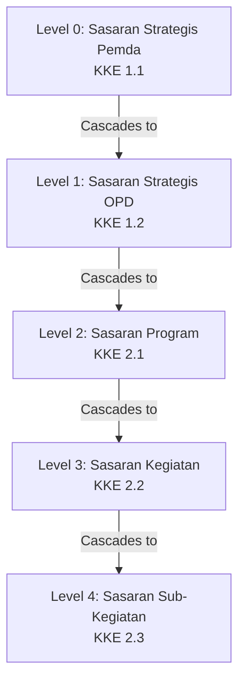

# Product Requirement Document (PRD) - Version 2.0
## Project Name: E-SPIP Terintegrasi (Centralized Internal Control & Maturity Assessment System)

---

## 1. Document Control
* **Version:** 2.0.0
* **Date:** June 29, 2026
* **Target Tech Stack:** Laravel 11+, PostgreSQL / Supabase, Alpine.js / Livewire v3+ (SPA Mode), Vanilla CSS
* **Workspace:** `satriaasn/spip`
* **Reference File:** `KK PM SPIP Pemda _Pembahasan terakhir.xlsx`

---

## 2. Executive Summary & Core Objective
The **E-SPIP Terintegrasi** application digitizes, decentralizes, and automates the local government working papers (*Kertas Kerja Penilaian Mandiri SPIP Pemda*) based on the latest sheet structures. 

Instead of cramming 38+ regional departments (OPD) side-by-side in extremely wide spreadsheets, the system provides a clean, menu-driven web interface. It isolates each OPD’s workspace to let them input their planning, evaluate their performance, and complete their subelement self-assessments. The system then dynamically aggregates this decentralized data into the regional Pemda-level dashboards.

### Major Changes in V2:
1. **Isolated Kertas Kerja per OPD**: OPDs no longer see wide column grids. They have dedicated forms to record evaluations.
2. **Owner-based Sheet Administration (Pemda Level)**:
   * **Bappeda**: Manages `KKE 1.1`, `KK3.1`, `KK 5.1 A`.
   * **BPKAD**: Manages `KK3.2`, `KK3.3`, `KK 6`, `KK 7`.
   * **Inspektorat**: Manages `KK3.4`, `KK 8`, and performs final QA validation on all sheets.
3. **Formula Alignment and Verification**: Handles the Excel aggregation logic, including mathematical inconsistencies (formula bugs) discovered in the reference workbook.

---

## 3. User Roles & Role-Based Access Control (RBAC)

The system enforces role scoping for both Pemda-level coordinators and individual departments (acting as OPDs). Note that coordination bodies like Bappeda, BPKAD, and Inspektorat also act as OPDs themselves when filling out their own internal assessments.

| Role | Scope & Permissions | Key Responsibilities |
| :--- | :--- | :--- |
| **Super Admin / Secretariat** | Global CRUD Access | System setup, fiscal year locking, master parameters configuration, user management. |
| **Bappeda (Pemda Planning)** | Pemda Level + Own OPD | 1. Input Pemda Strategic Objectives (`KKE 1.1`).<br>2. Verify planning alignments (`KKE 1.2` to `2.3`).<br>3. Manage and verify `KK3.1` (Efisiensi & Efektivitas) and `KK 5.1 A` (Pemda Outcomes). |
| **BPKAD (Pemda Finance/Asset)** | Pemda Level + Own OPD | 1. Manage and verify `KK3.2` (Pelaporan Keuangan) and `KK3.3` (Pengamanan Aset).<br>2. Manage `KK 6` (Opini LK) and `KK 7` (Catatan Aset). |
| **Inspektorat (Pemda Audit/QA)** | Global Auditor + Own OPD | 1. Manage and verify `KK3.4` (Ketaatan) and `KK 8` (Temuan Audit/Korupsi).<br>2. Override/verify all OPD self-assessments.<br>3. Lock the fiscal year evaluations (Final QA sign-off). |
| **OPD User (Department Operator)** | Scope: Own Department | 1. Cascade Pemda goals into OPD objectives, programs, activities, and sub-activities (`KKE 1.2` to `2.3`).<br>2. Complete planning quality checklists (Yes/No, AoI, Cause).<br>3. Fill out own OPD self-assessment columns in `KK3.1` - `KK3.4`. |

---

## 4. Master Data & Cascading Performance Tree (Pohon Kinerja)

The system builds a hierarchical planning tree (parent-child self-referencing structure) that represents how local government goals cascade down to sub-activities.



### Cascading Rules:
1. **Pemda Objective (`KKE 1.1`)**: Created by Bappeda. Contains:
   * Sasaran Strategis Pemda
   * Indikator Kinerja Sasaran
   * Target Kinerja
   * Satuan
2. **OPD Objective (`KKE 1.2`)**: Created by each OPD. Relates back to a Pemda Objective.
3. **OPD Program (`KKE 2.1`)**: Created by each OPD. Relates back to an OPD Objective.
4. **OPD Kegiatan (`KKE 2.2`)**: Created by each OPD. Relates back to an OPD Program.
5. **OPD Sub-Kegiatan (`KKE 2.3`)**: Created by each OPD. Relates back to an OPD Kegiatan.

---

## 5. Collaborative Appraisal Form Engine (KKE 1.1 to KKE 2.3)

For each planning level, the system displays a form where the user enters data and completes a Quality Assessment (Kualitas). 

### Quality Parameters per Level:
1. **`KKE 1.1` (Pemda Sasaran)**:
   * *Sasaran Strategis Tepat* (Y/T)
   * *Indikator Kinerja Tepat dan Baik* (Y/T)
   * *Target Kinerja Baik* (Y/T)
2. **`KKE 1.2` (OPD Sasaran)**:
   * *Keterkaitan dengan Sasaran Pemda* (Y/T)
   * *Sasaran Strategis OPD Tepat* (Y/T)
   * *Indikator Kinerja Tepat dan Baik* (Y/T)
   * *Target Kinerja Baik* (Y/T)
3. **`KKE 2.1` (OPD Program)**:
   * *Keterkaitan dengan Sasaran OPD* (Y/T)
   * *Sasaran Program Tepat* (Y/T)
   * *Indikator Kinerja Tepat dan Baik* (Y/T)
   * *Target Kinerja Baik* (Y/T)
4. **`KKE 2.2` (OPD Kegiatan)**:
   * *Keterkaitan dengan Sasaran Program* (Y/T)
   * *Sasaran Kegiatan Tepat* (Y/T)
   * *Indikator Kinerja Tepat dan Baik* (Y/T)
   * *Target Kinerja Baik* (Y/T)
5. **`KKE 2.3` (OPD Sub-Kegiatan)**:
   * *Keterkaitan dengan Sasaran Kegiatan* (Y/T)
   * *Indikator Kinerja Tepat dan Baik* (Y/T)
   * *Target Kinerja Baik* (Y/T)

### Assessment Cell Structure:
For each parameter, the system collects:
1. **Evaluation Result**: Yes (`Y`) or No (`T`).
2. **Area of Improvement (AoI)**:
   * *AoI Cluster*: Selected from a dropdown reference (e.g., "Target tidak SMART-C").
   * *AoI Description*: Text input detailing the specific improvement needed.
3. **Cause (Penyebab)**:
   * *Cause Cluster*: Selected from a dropdown reference (Man, Method, Money, Material, Machine).
   * *Cause Description*: Text input detailing the reason.

---

## 6. Subelement Self-Assessment & Verification Engine (KK 3.1 to KK 3.4)

These sheets evaluate the 25 subelements of SPIP internal control across 4 goals/pillars:
* **`KK3.1` (T1 - Efisiensi & Efektivitas)**: Owned by **Bappeda**.
* **`KK3.2` (T2 - Keandalan Pelaporan Keuangan)**: Owned by **BPKAD**.
* **`KK3.3` (T3 - Pengamanan Aset)**: Owned by **BPKAD**.
* **`KK3.4` (T4 - Ketaatan pada Peraturan)**: Owned by **Inspektorat**.

### OPD Individual Assessment Block:
Instead of a side-by-side table, each OPD is given an individual assessment form for each parameter. They submit:
1. **Uraian Hasil Pengujian**: Text description of the verification findings.
2. **Grade**: Select `A`, `B`, `C`, `D`, or `E` (representing maturity levels 5 down to 1).
3. **AoI Cluster & Description**: Categories and notes.
4. **Cause Cluster & Description**: Categories and notes.

### Pemda-Level Aggregation Logic (The Mode Method):
1. For each parameter, the system gathers the grades (`A`, `B`, `C`, `D`, `E`) entered by all reporting OPDs.
2. It counts the occurrences of each grade.
3. The **Mode** (most frequent grade) becomes the Pemda's aggregate grade.
4. The aggregate grade is converted to a numeric score:
   * `A` = 5, `B` = 4, `C` = 3, `D` = 2, `E` = 1.

### CRITICAL FINDING: Spreadsheet Formula Bugs
> [!IMPORTANT]
> The reference spreadsheet contains critical mathematical bugs in its subelement averages.
> Because the sheet authors omitted parentheses when dividing, Excel only divides the *last term* of the sum, creating highly inflated scores.
> 
> * **Example from `KK3.4` Row 10 (Subelement 1.1 average)**:
>   Formula is: `IFERROR(Term1 + Term2 + ... + Term8 / 8, "")`
>   Which evaluates as: `Term1 + Term2 + ... + (Term8 / 8) = 27.5` instead of `3.375`.
> * **Example from `KK3.1` Row 22 (Subelement 1.3 average)**:
>   Formula is: `IFERROR(Term1 + Term2 + Term3 + Term4 / 4, "")`
>   Which evaluates as: `Term1 + Term2 + Term3 + (Term4 / 4) = 9.75` instead of `3.0`.
>
> **System Requirement**:
> The system must support two scoring calculation modes switchable via settings (with "Bug Emulation" as default to match the BPKP excel spreadsheet totals, and "Mathematically Correct" as the true average option).

---

## 7. Achievement Assessment Engine (KK 5.1 to KK 8)

Evaluates actual performance outcomes, outputs, and financial/compliance status.

* **`KK 5.1 A` (Pemda Outcomes)**: Managed by Bappeda. Measures achievement of regional indicators.
* **`KK 5.1 B` (OPD Outcomes)**: Completed by each OPD. Measures achievement of department outcome indicators.
* **`KK 5.2` (OPD Outputs)**: Completed by each OPD. Measures achievement of activity output indicators.
* **`KK 6` (Financial Reporting)**: Managed by BPKAD. Records BPK audit opinions and findings.
* **`KK 7` (Asset Management)**: Managed by BPKAD. Records asset security findings.
* **`KK 8` (Compliance & Anti-Corruption)**: Managed by Inspektorat. Records compliance findings and corruption cases.

---

## 8. Dynamic Aggregation & Roll-up Dashboard (The Lead Sheets)

The system computes all indices in real-time without manual compilation:

1. **`KKLEAD I` (Penetapan Tujuan)**:
   * Score = `Compliance Rate (fraction of Y answers) * Weight`.
   * Maps to Levels: Level 1 (<=60%), Level 2 (60%-70%), Level 3 (70%-80%), Level 4 (80%-90%), Level 5 (>90%).
2. **`KKLEAD II` (Struktur dan Proses)**:
   * Pulls the averages for each of the 25 subelements across the 4 pillars (T1, T2, T3, T4).
   * Computes the average across the pillars for each parameter.
3. **`KKLEAD III` (Pencapaian Tujuan)**:
   * Converts qualitative opinions (like BPK WTP) and achievement rates to grades (A to E) and scores (1 to 5).
4. **`KKLEAD_SPIP` (Master Dashboard)**:
   * **SPIP Maturity Index** = `(Penetapan Tujuan * 40%) + (Struktur dan Proses * 30%) + (Pencapaian Tujuan * 30%)`.
   * **Indeks Penerapan Manajemen Risiko (MRI)** = Compiled from planning, capabilities, risk processes, and outcomes.
   * **Indeks Efektivitas Pencegahan Korupsi (IEPK)** = Compiled from anti-corruption policies, compliance findings, and whistleblowing.

---

## 9. Database Schema Design (PostgreSQL / Supabase)

```sql
-- 1. Reference: OPD Directory
CREATE TABLE ref_opd (
    id SERIAL PRIMARY KEY,
    code_opd VARCHAR(50) UNIQUE NOT NULL,
    name_opd VARCHAR(255) NOT NULL,
    created_at TIMESTAMP DEFAULT CURRENT_TIMESTAMP
);

-- 2. Master: Cascading Pohon Kinerja (Unified Hierarchy)
CREATE TABLE mst_pohon_kinerja (
    id SERIAL PRIMARY KEY,
    parent_id INT REFERENCES mst_pohon_kinerja(id) ON DELETE CASCADE,
    fiscal_year INT NOT NULL,
    level_type VARCHAR(50) NOT NULL, -- 'PEMDA', 'OPD', 'PROGRAM', 'KEGIATAN', 'SUB_KEGIATAN'
    opd_id INT REFERENCES ref_opd(id) NULL,
    title_objective TEXT NOT NULL,
    indicator_name TEXT NOT NULL,
    target_value VARCHAR(100) NOT NULL,
    unit_of_measurement VARCHAR(50) NOT NULL,
    created_at TIMESTAMP DEFAULT CURRENT_TIMESTAMP
);

-- 3. Transaction: KKE Planning Quality Checklists
CREATE TABLE trx_kke_assessment (
    id SERIAL PRIMARY KEY,
    pohon_kinerja_id INT REFERENCES mst_pohon_kinerja(id) ON DELETE CASCADE,
    opd_id INT REFERENCES ref_opd(id) ON DELETE RESTRICT,
    fiscal_year INT NOT NULL,
    assessment_type VARCHAR(50) NOT NULL, -- 'KKE_1.1', 'KKE_1.2', 'KKE_2.1', 'KKE_2.2', 'KKE_2.3'
    
    -- Checklist Parameters stored as JSONB to enable dynamic columns
    -- Schema: { "parameter_key": { "result": "Y/T", "aoi_cluster": "...", "aoi_desc": "...", "cause_cluster": "...", "cause_desc": "..." } }
    assessment_data JSONB NOT NULL,
    
    status_flow VARCHAR(40) DEFAULT 'OPD_DRAFT', -- 'OPD_DRAFT', 'BAPPEDA_VERIFY', 'FINAL_LOCKED'
    updated_at TIMESTAMP DEFAULT CURRENT_TIMESTAMP
);

-- 4. Transaction: KK3.x Subelement Evaluations (OPD Level)
CREATE TABLE trx_subelement_assessment (
    id SERIAL PRIMARY KEY,
    opd_id INT REFERENCES ref_opd(id) ON DELETE RESTRICT,
    fiscal_year INT NOT NULL,
    pillar_type VARCHAR(10) NOT NULL, -- 'T1', 'T2', 'T3', 'T4' (KK3.1 - KK3.4)
    subelement_code VARCHAR(10) NOT NULL, -- e.g., '1.1', '1.2', '1.3'
    parameter_no INT NOT NULL, -- point number
    
    -- OPD Self-Assessment
    opd_uraian TEXT NULL,
    opd_grade CHAR(1) NULL, -- 'A', 'B', 'C', 'D', 'E'
    opd_aoi_cluster VARCHAR(255) NULL,
    opd_aoi_desc TEXT NULL,
    opd_cause_cluster VARCHAR(255) NULL,
    opd_cause_desc TEXT NULL,
    
    -- Pemda Verification / QA Overrides
    verified_grade CHAR(1) NULL,
    verified_by_user_id INT NULL,
    verification_notes TEXT NULL,
    
    status_flow VARCHAR(40) DEFAULT 'OPD_DRAFT',
    updated_at TIMESTAMP DEFAULT CURRENT_TIMESTAMP
);

-- 5. Transaction: KK5 to KK8 Performance Outcomes
CREATE TABLE trx_achievement_assessment (
    id SERIAL PRIMARY KEY,
    opd_id INT REFERENCES ref_opd(id) NULL, -- Null for Pemda level
    fiscal_year INT NOT NULL,
    kk_type VARCHAR(10) NOT NULL, -- 'KK5.1A', 'KK5.1B', 'KK5.2', 'KK6', 'KK7', 'KK8'
    data_payload JSONB NOT NULL, -- Contains specific row metrics for opinions, findings, outcomes
    updated_at TIMESTAMP DEFAULT CURRENT_TIMESTAMP
);

-- Create performance indexes for nested recursive tree lookups and aggregation
CREATE INDEX idx_pohon_kinerja_parent ON mst_pohon_kinerja(parent_id);
CREATE INDEX idx_subelement_lookup ON trx_subelement_assessment(fiscal_year, pillar_type, subelement_code);
```

---

## 10. Proposed User Interface & Navigation Workflow

The system provides a sidebar menu partitioned by role and scope:

1. **Dashboard**: Shows the Radar Chart and SPIP, MRI, IEPK indices. Clicking details drills down to see the calculations.
2. **Perencanaan & KKE (Planning)**:
   * *Pemda Planning (`KKE 1.1`)*: Restricted to Bappeda. Form to create and score Level 0 objectives.
   * *OPD Planning Cascading (`KKE 1.2` to `2.3`)*: Dynamic table where OPDs select parent items and add nested programs/activities/sub-activities, completing quality checklists in-line.
3. **Penilaian Mandiri KK3 (Subelements)**:
   * *Subelement Self-Assessment*: Clean step-by-step form for the active OPD. Displays the 25 subelements. OPD enters descriptions and grades.
   * *Verification Panel*: Side-by-side verification screen for Bappeda (`KK3.1`), BPKAD (`KK3.2/3.3`), and Inspektorat (`KK3.4`) to audit inputs, view uploaded files, and enter the verified grades.
4. **Pencapaian Tujuan (Outcomes & Audits)**:
   * Menu to record actual targets vs achievements (`KK 5.1` - `5.2`) and audit findings (`KK 6` - `8`).
5. **System Settings**:
   * Switch between "Mathematically Correct" and "BPKP Spreadsheet Emulation" modes for calculations.
